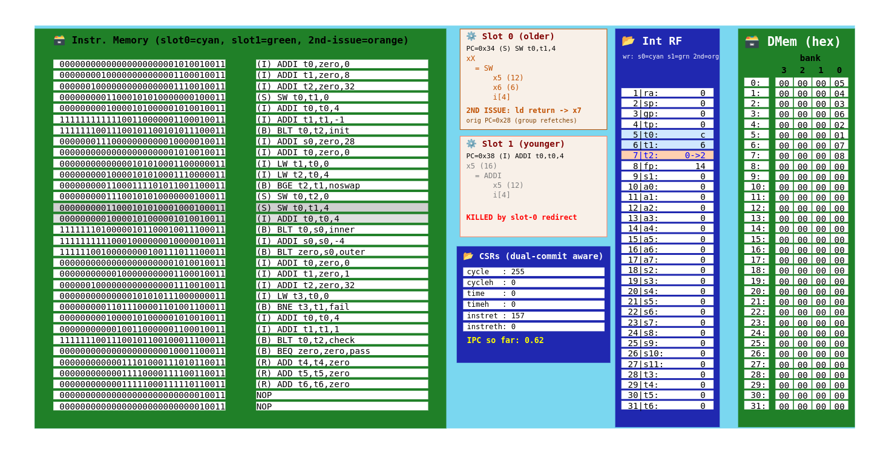

# Dual-Issue Superscalar RISC-V Processor in TL-Verilog

A two-wide, in-order **superscalar RISC-V processor** built by extending a single-issue core generated by the **WARP-V** core generator. The second execution path is created using TL-Verilog's hierarchy and replication features — by making the per-instruction scope hold two instructions instead of one — rather than by duplicating the pipeline.

**ISA:** RV32I + Zicsr counters &nbsp;•&nbsp; **Issue width:** 2 (in-order) &nbsp;•&nbsp; **Language:** TL-Verilog &nbsp;•&nbsp; **Platform:** [Makerchip IDE](https://makerchip.com)


<p align="center">
  
</p>

---

## Table of Contents

1. [Motivation](#1-motivation)
2. [TL-Verilog](#2-tl-verilog)
3. [The WARP-V Core Generator](#3-the-warp-v-core-generator)
4. [Baseline Core Operation](#4-baseline-core-operation)
5. [Dual-Issue Architecture](#5-dual-issue-architecture)
6. [Implementation](#6-implementation)
7. [Hazards Introduced by Dual Issue](#7-hazards-introduced-by-dual-issue)
8. [Test Program](#8-test-program)
9. [Running the Design](#9-running-the-design)
10. [Limitations and Future Improvements](#10-limitations-and-future-improvements)
11. [References and Credits](#11-references-and-credits)

---

## 1. Motivation

A scalar, single-issue processor completes at most one instruction per clock cycle, which bounds its throughput at an IPC (instructions per cycle) of one. A **superscalar** processor widens the datapath so that several instructions occupy the same pipeline stage simultaneously, lifting that ceiling.

The processor in this repository is **two-wide**: every cycle it can fetch, decode, execute, and retire up to two instructions. It is strictly **in-order** — instructions issue and retire in program order, without dynamic reordering — which is the simplest superscalar organisation to reason about and the natural target when extending an in-order baseline.

The project was subject to one firm structural constraint. The WARP-V generator emits only single-issue cores, and the second issue path was to be obtained through **TL-Verilog hierarchy and instantiation**, not by copying the pipeline. That constraint shaped every design decision documented below.

---

## 2. TL-Verilog

**TL-Verilog** (Transaction-Level Verilog) is a hardware description methodology developed by **Redwood EDA**. It extends Verilog/SystemVerilog with a higher level of abstraction centred on *pipelines*, *transactions*, and *hierarchy*, and is supported by the **SandPiper** transpiler, which emits standard SystemVerilog. Two of its capabilities are foundational to this project.

### 2.1 Automatic pipelining

A signal written as `$sig` inside a stage `@n` is registered through the pipeline automatically. Reading a value from an earlier cycle is expressed by an alignment operator: `>>1$sig` reads the value one cycle earlier, `>>3$sig` three cycles earlier. The required flip-flops are inferred by the toolchain.

```tlv
@2
   $a[31:0] = $b + $c;      // computed in stage 2
@3
   $d[31:0] = >>1$a;        // stage-3 read of the stage-2 value from one cycle back
```

No pipeline registers are ever declared by hand and no retiming is done manually. This is what allows a multi-stage operand-forwarding network to be expressed in a handful of readable lines instead of a large block of explicit registers and multiplexers.

### 2.2 Hierarchy and replication

Logic is organised into named **scopes**. A scope such as `/instr` can be declared as an array — `/instr[1:0]` — whereupon the entire body of logic beneath it is instantiated once per index. The elaboration-time constant `#instr` identifies each instance, so a single description can specialise its copies.

```tlv
/instr[1:0]                            // one description, two instances
   @1
      $pc[31:0] = |fetch$Pc + (#instr << 2);   // instance-specific behaviour
```

This single feature is what converts one issue slot into two without a duplicated pipeline, and it is the mechanism on which the entire project rests.

### 2.3 Transactions

TL-Verilog models each in-flight item of work as a **transaction** flowing through a scope. In a CPU, a transaction is an instruction, and the scope it flows through is `/instr`. Because all per-instruction behaviour is concentrated in that one scope, replicating the scope replicates the instruction slot — cleanly and without touching the surrounding pipeline structure.

---

## 3. The WARP-V Core Generator

**WARP-V** is an open-source, highly configurable RISC-V CPU core generator written in TL-Verilog by Redwood EDA (Steve Hoover). From a set of configuration choices it emits a complete, synthesisable, single-issue RISC-V core, supporting multiple ISAs, pipeline depths, and micro-architectural options.

WARP-V provides **no multi-issue or superscalar option** of any kind. The dual-issue capability documented here is therefore an original extension layered on top of generated single-issue output, and not a configuration of the generator.

### 3.1 Configuration used

The baseline was generated with a realistic mid-depth pipeline and the simplest available branch predictor.

| Setting | Value | Consequence for the design |
|---|---|---|
| **Pipeline depth** | Fetch @1; decode, register read, branch predict @2; execute @3; result @4; register write and memory @5 | An operand-forwarding reach of three cycles, which the dual-issue network later widens. |
| **Branch prediction** | Fallthrough (always predict not-taken) | Branches redirect only when actually taken, resolved at execute. No early predicted-taken redirect exists to arbitrate between two slots. |
| **Hazard bubbles** | `EXTRA_NON_PIPELINED_BUBBLE = 1`, `EXTRA_TRAP_BUBBLE = 1`, others 0 | Fixes the redirect-timing alignments (`>>3` for traps) that the extension preserves verbatim. |
| **ISA** | RV32I + Zicsr counters | Base integer instruction set plus the `cycle`, `time`, and `instret` counters. |

Since the generator offers no superscalar mode, no alternative configuration could have reduced the work involved. This configuration simply provides the most tractable baseline to restructure: the fallthrough predictor in particular removes an entire class of control interaction between the two slots.

---

## 4. Baseline Core Operation

Understanding the modifications requires a clear picture of the machine being modified. The generated core operates as follows.

### 4.1 Pipeline and instruction scope

The core contains a single pipeline named `|fetch`. Every signal belonging to a specific instruction lives inside the scope `/instr` within it, with exactly one transaction per stage per cycle.

### 4.2 Fetch and the program counter

Each cycle the core forms the next fetch address, reads the corresponding 32-bit word from an on-chip instruction array, and begins decoding it. A single register `$Pc` holds the program counter, updated each cycle from a `$next_pc` value chosen by the redirect logic. The sequential default is the current PC plus four.

### 4.3 Decode

The raw instruction word is sliced into its RISC-V fields, the instruction is classified (load, store, branch, jump, CSR, ALU), and immediates are extracted per format. Source-register indices are produced inside a replicated sub-scope `/src[2:1]`, one instance per operand. The decode outputs — destination register, load/store classification, branch classification, source indices — drive every later stage and are precisely the signals the dual-issue hazard detectors later compare between slots.

### 4.4 Register read and operand forwarding

The register file holds the writable registers `x1`–`x31`. Reading a register that an in-flight instruction is about to write would return a stale value, so the value is **forwarded**: if a source index matches the destination of an instruction one, two, or three cycles ahead, the in-flight result is used instead of the register-file copy. The baseline network therefore offers **three** forwarding candidates, one per pipeline stage the value could still occupy.

### 4.5 The pending bit and replay

Alongside each register value the core maintains a `$pending` bit, indicating that the value is not yet available because its producer — typically a load — is still in flight. Any instruction that reads a pending source must **replay**: it aborts itself and is re-fetched, retrying until the value has landed.

Replay is a general-purpose recovery mechanism already present in the baseline. Its reuse is the central idea behind the hazard resolution described in [Section 7](#7-hazards-introduced-by-dual-issue).

### 4.6 Speculation control: the good-path mask

Because the pipeline fetches speculatively, the core must track which in-flight instructions lie on the correct execution path. WARP-V maintains a shifting bit-vector, `$GoodPathMask` — one bit per cycle in flight, a `1` meaning "good path."

Each cycle a set of **redirect conditions** is evaluated (taken branch, jump, trap, replay, load return). When one fires, the PC is steered to the corresponding target and the mask bits belonging to newly-invalidated younger instructions are cleared. An instruction may **commit** its results only if its mask bit is still set and it did not itself abort.

Redirect conditions carry a strict priority: a condition resolved at a *later* pipeline stage belongs to an *older* instruction whose decision is more final, and therefore outranks earlier-stage conditions. This mask machinery is the most delicate part of the core, and re-deriving it at two-instruction granularity was the hardest part of the project.

### 4.7 Execute

The execute stage produces results for every instruction class: ALU operations, branch resolution by comparison of the two source operands, jump and memory address generation, and trap detection. Store data and byte-enable masks are aligned to the low address bits so that sub-word writes touch only the intended bytes.

### 4.8 Loads and second issue

Loads cannot deliver their value on the first pass, because memory has latency. A load therefore commits immediately, writing a placeholder and setting `$pending` on its destination register. Several cycles later, when the data returns, the load **second-issues**: it re-enters the pipeline, clobbers whatever instruction occupies the slot it lands in, and performs the real register write, clearing the pending bit. Dependent instructions replay in the interval and eventually observe the correct value.

This mechanism is straightforward in a single-issue machine, but it forces a genuine design decision under dual issue — a returning load is an *old* instruction and must never occupy the younger slot beside a newly-fetched instruction, or program order would invert.

### 4.9 Data memory and CSRs

The data memory is a byte-addressable array organised as four byte-banks, providing a **single** load/store port — one memory operation per cycle. The core also implements the RISC-V counter CSRs (`cycle`, `time`, `instret`), each a 64-bit quantity split across a low/high register pair.

In the baseline, both the register file and the data memory reside **inside** `/instr`. That placement is the reason both must be relocated before the scope is replicated, as described next.

---

## 5. Dual-Issue Architecture

### 5.1 Replicating the transaction, not the pipeline

The obvious route to a two-wide machine — laying down a second copy of the pipeline — was rejected. Duplication doubles the source to maintain and, more importantly, duplicates hardware that must physically exist only once, such as the register file and the data memory.

The architecture instead exploits the fact that all per-instruction behaviour already resides in a single scope. That scope becomes an array of two, `/instr[1:0]`, and the toolchain builds the entire body — decode, operand read, execute, result, commit — **twice** from one description. Everything genuinely shared is deliberately kept *outside* the replicated scope as a single instance.

The architecture reduces to one sentence: **one description, two slots, one shared spine.**

### 5.2 Fetch groups and slot ordering

Each cycle the front end fetches a **fetch group** of two consecutive instructions that traverse the pipeline together:

- **Slot 0** (`/instr[0]`) — the **older** instruction in program order, fetched at `$Pc`
- **Slot 1** (`/instr[1]`) — the **younger** instruction, fetched at `$Pc + 4`

With two instructions consumed per cycle, the sequential stride becomes **eight bytes**. A control-flow redirect may target any 4-byte-aligned address; the next group is simply the target and the following word, so no fetch-alignment or rotation hardware is required.

### 5.3 Shared versus replicated logic

Every element of the core was sorted into two categories: logic describing a single instruction (safe to replicate) and hardware representing shared machine state (necessarily singular). The latter is **hoisted** out of `/instr` into the enclosing `|fetch` scope so that exactly one copy exists.

| Replicated per slot (inside `/instr[1:0]`) | Hoisted and shared (in `\|fetch`) |
|---|---|
| Decode and field extraction | Program counter and next-PC arbitration |
| Immediate generation; illegal-instruction check | Good-path mask and redirect priority |
| Operand read and per-slot forwarding multiplexers | Architectural register file (two write ports) |
| ALU, execute, result selection | Data memory (one load/store port) |
| Per-slot commit and abort decision | CSR counter state |
| Load-address and store-data formation | Forwarding-availability signals |
| CSR address decode and write value | Test-bench pass/fail evaluation |

### 5.4 Governing invariants

Two invariants hold the design together. Every mechanism described in the following sections enforces one of them.

> **Invariant I — Age order is absolute.**
> Slot 0 is always older than slot 1 in program order. This is why slot 0 wins every priority tie, why load returns are routed through slot 0, and why the register file resolves a same-register write conflict in favour of slot 1 (the younger instruction, whose write must persist).

> **Invariant II — Asymmetric protection.**
> Slot 0 is never harmed by anything slot 1 does; slot 1 is always killed by anything slot 0 does that diverts control flow. Enforcement rests on an asymmetric good-path mask and on a dedicated kill signal for slot 1.

### 5.5 Structure

```
|fetch                        // one shared pipeline
   @1  program counter, redirect arbitration, good-path mask
   @2  slot-0 redirect summary, forwarding availability (shared)
   @3  slot-0 redirect summary (final), test pass/fail
   /instr[1:0]                // TWO slots built from ONE description
      @1  per-slot PC and fetch; route returning loads to slot 0
      @2  decode, operand read + 6-way forwarding, hazard detect, replay
      @3  execute, address/data formation, commit decision, slot-1 kill
      @4  result selection
   /regs[31:1]  @5            // shared register file, TWO write ports
   /bank[3:0]/mem  @5         // shared data memory, ONE port
   (CSR counter state)        // shared; software access from slot 0
```

---

## 6. Implementation

### 6.1 Replication of the instruction scope

The single change that makes the processor superscalar is the conversion of the instruction scope into an array. Where the baseline declares `/instr`, the dual-issue core declares `/instr[1:0]`:

```tlv
/instr[1:0]
   @0
      $reset = |fetch$reset;
   @1
      $fetch = |fetch$fetch;
      // Per-slot PC: slot 0 fetches at the group PC, slot 1 at group PC + 4.
      $pc[31:0] = |fetch$Pc + (#instr << 2);
      $pc_inc[31:0] = $pc + 32'd4;
```

From this point every signal inside the slot exists in two copies. Wherever the copies must differ, the elaboration constant `#instr` (0 for slot 0, 1 for slot 1) is consulted — its first use being the per-slot program counter above, where `#instr << 2` evaluates to "instance number times four."

### 6.2 Per-slot address computation

Every execute-stage computation that referenced the program counter was moved from the group PC to the slot's own `$pc`:

```tlv
$branch_target[31:0] = $pc[31:0] + $raw_b_imm[31:0];   // per-slot branch target
$jump_target[31:0]   = $pc[31:0] + $raw_j_imm[31:0];   // per-slot jump target
$auipc_rslt[31:0]    = $pc + $raw_u_imm;               // per-slot AUIPC
$jal_rslt[31:0]      = $pc + 4;                        // per-slot link address
$jalr_rslt[31:0]     = $pc + 4;
```

Left on the group PC, slot 1 would compute every branch and jump target four bytes low. This change is what allows both instructions of a group to be architecturally correct simultaneously.

### 6.3 The shared next-PC arbiter

A redirect can now originate in either slot, and the two cases require different treatment. Every redirect condition was split into a slot-0 form and a slot-1 form, each qualified by the group's good-path bit. The slot-1 forms carry an additional qualifier, `(! >>N$slot0_redir_e3)`, expressing "if slot 0 of this group has already redirected, slot 1 lies on the wrong path and must not steer the PC."

A single priority multiplexer then selects the target:

```tlv
{$next_pc[31:0], $next_no_fetch} =
   $reset ? {32'b0, 1'b0} :
   $non_aborting_trap_cond_0 ? {/instr[0]>>3$trap_target, 1'b0} :
   $aborting_trap_cond_0     ? {/instr[0]>>3$trap_target, 1'b0} :
   $non_pipelined_cond_0     ? {/instr[0]>>3$pc_inc, 1'b1} :
   $non_aborting_trap_cond_1 ? {/instr[1]>>3$trap_target, 1'b0} :
   $aborting_trap_cond_1     ? {/instr[1]>>3$trap_target, 1'b0} :
   $non_pipelined_cond_1     ? {/instr[1]>>3$pc_inc, 1'b1} :
   $indirect_jump_cond_0     ? {/instr[0]>>2$indirect_jump_target, 1'b0} :
   $mispred_branch_cond_0    ? {/instr[0]>>2$branch_redir_pc, 1'b0} :
   $jump_cond_0              ? {/instr[0]>>2$jump_target, 1'b0} :
   $indirect_jump_cond_1     ? {/instr[1]>>2$indirect_jump_target, 1'b0} :
   $mispred_branch_cond_1    ? {/instr[1]>>2$branch_redir_pc, 1'b0} :
   $jump_cond_1              ? {/instr[1]>>2$jump_target, 1'b0} :
   $replay_cond_0            ? {/instr[0]>>1$pc, 1'b0} :
   $replay_cond_1            ? {/instr[1]>>1$pc, 1'b0} :
   $second_issue_cond        ? {>>0$Pc, 1'b0} :
   $no_fetch_cond            ? {>>0$Pc, 1'b1} :
              {$Pc + 32'd8, 1'b0};   // Default: sequential fetch of the next group of two.
```

The ordering embodies the priority rule: **a later pipeline stage wins**, and **within a stage, slot 0 precedes slot 1**. The default case is the two-instruction sequential stride. The two replay cases target the individual slot's own PC — the property on which the hazard resolution rests.

### 6.4 The asymmetric good-path mask

The good-path mask is where Invariant II is physically encoded. Each condition clears mask bits according to how many younger instructions it invalidates. Slot-0 conditions retain the original single-issue patterns; slot-1 *aborting* conditions clear **one bit fewer**, so the group's own bit survives and slot 0 still commits:

```tlv
$next_good_path_mask[3+1:0] =
   {$GoodPathMask[3:0]
     // Slot-0-triggered conditions keep original (single-issue) mask semantics:
     & ($replay_cond_0            ? 4'b1100 : 4'b1111)
     & ($aborting_trap_cond_0     ? 4'b0000 : 4'b1111)
     // ...
     // Slot-1-triggered conditions: the group survives (slot 0 must commit), so
     // aborting conditions clear one bit fewer than their slot-0 counterparts.
     & ($replay_cond_1            ? 4'b1110 : 4'b1111)
     & ($aborting_trap_cond_1     ? 4'b1000 : 4'b1111),
    1'b1};
```

The aborting-trap pair gives the clearest contrast: slot 0 uses `4'b0000` (its own group and everything younger dies), whereas slot 1 uses `4'b1000` (the group's own bit survives). That one-bit asymmetry constitutes the entire "slot 0 survives even when slot 1 aborts" guarantee.

### 6.5 Redirect summaries and the slot-1 kill

Two summary signals answer the question "has the older sibling already diverted the PC?" — the first collecting slot 0's early redirect causes, the second completing the set at stage 3:

```tlv
$slot0_redir_e2 = /instr[0]$second_issue || /instr[0]$replay || /instr[0]$jump
               || /instr[0]$indirect_jump || /instr[0]$non_pipelined;
@3
$slot0_redir_e3 = $slot0_redir_e2 || /instr[0]$mispred_branch
               || /instr[0]$aborting_trap || /instr[0]$non_aborting_trap;
```

These close a subtle gap. When slot 0 takes a *non-aborting* redirect — a jump, a taken branch, a non-pipelined bubble — the group is deliberately left good-path so that slot 0 itself can commit. Slot 1, however, sits at the same mask bit and would wrongly commit as well. A dedicated kill signal removes exactly slot 1 in that situation:

```tlv
$killed_by_slot0 = (#instr != 0) && |fetch$slot0_redir_e3;
$good_path = (! $reset && |fetch>>-2$next_good_path_mask[3] && ! $killed_by_slot0);
$commit = $good_path && ! $abort;
```

The mask therefore handles aborting redirects at group granularity, while `$killed_by_slot0` handles the non-aborting slot-0 redirects that must spare slot 0 but kill slot 1.

### 6.6 Six-way operand forwarding

Where the baseline forwarded from an instruction one, two, or three cycles ahead — three candidates — each of those cycles now holds two instructions, giving **six** possible producers. Six availability qualifiers are computed once in the shared scope and reused by both consuming slots:

```tlv
$bypass_avail1_s0 = /instr[0]>>1$commit_dest_reg && ($GoodPathMask[1] || /instr[0]>>1$commit_second_issue);
$bypass_avail1_s1 = /instr[1]>>1$commit_dest_reg && ($GoodPathMask[1] || /instr[1]>>1$commit_second_issue);
// ... depths 2 and 3 follow the same pattern
```

Operand read then selects among the six in **youngest-first** order — if two older instructions both wrote the required register, the more recent write in program order must win:

```tlv
{$reg_value[31:0], $pending} =
   ($reg == 5'b0) ? {32'b0, 1'b0} :
   (|fetch$bypass_avail1_s1 && (|fetch/instr[1]>>1$wr_reg == $reg)) ? {|fetch/instr[1]>>1$rslt, ...} :
   (|fetch$bypass_avail1_s0 && (|fetch/instr[0]>>1$wr_reg == $reg)) ? {|fetch/instr[0]>>1$rslt, ...} :
   (|fetch$bypass_avail2_s1 && (|fetch/instr[1]>>2$wr_reg == $reg)) ? {|fetch/instr[1]>>2$rslt, ...} :
   (|fetch$bypass_avail2_s0 && (|fetch/instr[0]>>2$wr_reg == $reg)) ? {|fetch/instr[0]>>2$rslt, ...} :
   (|fetch$bypass_avail3_s1 && (|fetch/instr[1]>>3$wr_reg == $reg)) ? {|fetch/instr[1]>>3$rslt, ...} :
   (|fetch$bypass_avail3_s0 && (|fetch/instr[0]>>3$wr_reg == $reg)) ? {|fetch/instr[0]>>3$rslt, ...} :
   {$rf_value, |fetch/regs[$reg]>>3$pending};
```

Both the value and its pending bit are forwarded. The candidate order — slot 1 before slot 0 at every depth — is Invariant I written directly into the multiplexer.

### 6.7 Register file with two write ports

The register file resided inside `/instr`; replicated unchanged, two register files would have resulted. It was hoisted into the shared scope and, since two instructions may now retire per cycle, equipped with **two write ports**:

```tlv
/regs[31:1]
   $wr0 = |fetch/instr[0]$commit_dest_reg && (|fetch/instr[0]$wr_reg == #regs);
   $wr1 = |fetch/instr[1]$commit_dest_reg && (|fetch/instr[1]$wr_reg == #regs);
   <<1$value[31:0] = $wr1 ? |fetch/instr[1]$rslt :
                     $wr0 ? |fetch/instr[0]$rslt :
                            $value;
```

The value multiplexer tests `$wr1` first, so a same-register, same-cycle conflict resolves in favour of **slot 1** — the younger instruction, whose write must persist. The write-after-write hazard prevents that collision from arising in practice, but the priority is retained as a safety net. Four read ports (two sources for each of two slots) are served through the shared `/regs` references.

### 6.8 Shared single-port data memory

The data memory was hoisted for the same reason. Because the memory hazard guarantees at most one memory operation per group, a two-to-one multiplexer suffices to select the slot that drives the single port:

```tlv
$dm_slot1 = ! /instr[0]$ld_st_cond;   // The group's memory op (if any) is in slot 1.
$dm_addr[31:0]     = $dm_slot1 ? /instr[1]$addr     : /instr[0]$addr;
$dm_valid_st       = /instr[0]$valid_st || /instr[1]$valid_st;
$dm_st_value[31:0] = $dm_slot1 ? /instr[1]$st_value : /instr[0]$st_value;
$dm_st_mask[3:0]   = $dm_slot1 ? /instr[1]$st_mask  : /instr[0]$st_mask;
```

The multiplexer is correct precisely *because* of the hazard rule; without it, both slots could contend for the port within one cycle.

### 6.9 Superscalar-aware CSRs

The CSR counter state was hoisted so that a single copy is shared, and software CSR writes are bound to slot 0. The retired-instruction counter was made superscalar-aware: rather than incrementing by one per cycle, it accumulates the commit signals of *both* slots.

```tlv
$full_csr_instret_hw_wr_value[63:0] = {$csr_instreth, $csr_instret}
                                    + {63'b0, /instr[0]$commit}
                                    + {63'b0, /instr[1]$commit};
```

With `instret` counting both slots and `cycle` counting elapsed cycles, software can read the two counters and compute the core's live IPC on itself — a direct, quantitative demonstration that the second slot performs real work.

### 6.10 Load-return steering

Every load return is steered into slot 0, and the slot from which the load originally issued is recorded. Because that slot may have been either one, the original-load record cannot be recovered with the baseline's wildcard copy; it is reconstructed with explicit multiplexers keyed on the recorded slot:

```tlv
/orig_load_inst
   $dest_reg[4:0]   = /instr$ld_ret_s1 ? |fetch/instr[1]>>5$dest_reg   : |fetch/instr[0]>>5$dest_reg;
   $addr[31:0]      = /instr$ld_ret_s1 ? |fetch/instr[1]>>5$addr       : |fetch/instr[0]>>5$addr;
   $ld_st_word      = /instr$ld_ret_s1 ? |fetch/instr[1]>>5$ld_st_word : |fetch/instr[0]>>5$ld_st_word;
   // ...
   $ld_data[31:0]   = |fetch>>5$dm_ld_data;
```

Routing returns exclusively through slot 0 preserves Invariant I: a returning load, being an old instruction, never occupies the younger slot beside a newly-fetched one.

---

## 7. Hazards Introduced by Dual Issue

Issuing two instructions per cycle creates conflicts that a single-issue machine never encounters. In a single-issue pipeline every hazard is *between* instructions in *different* stages, covered by the forwarding network and the pending/replay mechanism. Dual issue adds a new category: two instructions in the **same stage, in the same cycle**. The existing machinery cannot detect these, because it only looks backward in time, never sideways within a cycle.

Four such **intra-group hazards** arise, all detected at the operand-read stage:

```tlv
$raw_haz = |fetch/instr[0]$dest_reg_valid &&
           ((/src[1]$is_reg_condition && (/src[1]$reg == |fetch/instr[0]$dest_reg)) ||
            (/src[2]$is_reg_condition && (/src[2]$reg == |fetch/instr[0]$dest_reg)));   // Read-after-write.
$waw_haz = |fetch/instr[0]$dest_reg_valid && $dest_reg_valid && ($dest_reg == |fetch/instr[0]$dest_reg);   // Write-after-write.
$mem_haz = (|fetch/instr[0]$ld_st && |fetch/instr[0]$valid_decode) && ($ld_st && $valid_decode);   // Structural: one data-memory port.
$csr_haz = $is_csr_instr && $valid_decode;   // Structural: CSR instructions execute in slot 0 only.
```

### 7.1 RAW — read-after-write between the slots

Slot 1 reads a register that slot 0 writes in the very same cycle. Slot 1 requires slot 0's result, but the two instructions execute side by side and the result does not yet exist.

In-cycle forwarding was deliberately rejected. Forwarding slot 0's result into slot 1 within the cycle would chain the two ALUs into one long combinational path, roughly doubling the execute-stage delay and degrading the achievable clock frequency. This is the classic superscalar frequency-versus-IPC trade-off, resolved here in favour of frequency; the cost is a few bubble cycles on slot 1, incurred only when a true dependency exists.

### 7.2 WAW — write-after-write between the slots

Both slots write the same destination register in the same cycle, and the two writes must not land out of program order. The check is strictly required only when slot 0 is a *load* — the load's later second-issue return would otherwise overwrite slot 1's newer value with stale data — but it is applied uniformly as a conservative simplification. The register file's slot-1-wins priority provides an independent second layer of protection.

### 7.3 Structural — contention on the memory port

The data memory exposes one load/store port, yet a fetch group may contain two memory instructions, which cannot both access the port in one cycle. Resolving this hazard also *guarantees* that at most one memory operation issues per group, which is precisely the property that makes the single-port memory multiplexer of Section 6.8 correct. The hazard rule and the shared-memory multiplexer are two halves of one idea.

### 7.4 Structural — contention on the CSR port

The CSR counter state exposes one software-write port, wired to slot 0, so a CSR instruction may execute only in slot 0. A CSR instruction landing in slot 1 re-executes as slot 0 of a later group. CSR instructions are rare, so the cost is negligible.

### 7.5 The unified resolution

All four hazards are resolved **identically**. The detectors are combined into a single condition, gated to slot 1 alone, and folded into the existing replay signal:

```tlv
$intra_group_replay = (#instr != 0) && $valid_decode &&
                      ($raw_haz || $waw_haz || $mem_haz || $csr_haz);

// Combined replay for this slot.
$replay = ($pending_replay) || $intra_group_replay;
```

A replay steers the PC to **slot 1's own address**. The offending slot-1 instruction is discarded and **re-fetched as slot 0 of a slightly later group**. By the time it returns as slot 0, the instruction it depended on — or the resource it required — has advanced far enough down the pipeline that the ordinary cross-group forwarding network supplies the value, or the shared port is free. Slot 0 of the original group is entirely unaffected and commits normally.

This is what distinguishes a genuine superscalar from two instructions marching in lockstep: a hazard costs slot 1 its issue opportunity for a couple of cycles but **never stalls slot 0**. No dedicated stall logic, no ALU-to-ALU forwarding cascade, and no memory arbiter were required.

| Hazard | Trigger | Resolution | Secondary benefit |
|---|---|---|---|
| **RAW** | Slot 1 reads slot 0's destination | Replay slot 1 | Keeps the two ALUs off the critical path |
| **WAW** | Both slots write one register | Replay slot 1 | Ordered writes; safe load returns |
| **Memory** | Two memory operations in one group | Replay slot 1 | Validates the single-port memory multiplexer |
| **CSR** | CSR instruction in slot 1 | Replay slot 1 | One CSR write port suffices |

### 7.6 Control hazards between the slots

Control hazards — where a branch, jump, or trap in one slot must redirect the fetch and invalidate the other — are handled not by replay but by the mask and kill logic:

- **Slot 0 redirects.** Slot 1 of the same group lies on the wrong path. If the redirect is *aborting* (a trap), the mask clears the group's own bit and both slots die. If it is *non-aborting* (jump, taken branch, non-pipelined bubble), the group remains good so slot 0 commits, and `$killed_by_slot0` removes slot 1 alone.
- **Slot 1 redirects.** Slot 0 is older and must survive. The slot-1 mask terms clear one bit fewer than their slot-0 counterparts, so the group's own bit stays set and slot 0 commits.
- **Both slots redirect at different stages.** The priority multiplexer together with the shifting mask sequences these correctly across cycles.

---

## 8. Test Program

The design is exercised by a **bubble sort of eight words held in data memory**, chosen because its inner loop reads two words, compares them, and writes both back on every iteration — making it a thorough test of the shared single-port data memory alongside the register file and control flow.

```
init:   a[0..7] = 8,7,6,5,4,3,2,1      // 8 SW stores (descending: worst case)
sort:   for limit = 28 down to 4       // outer pass
          for addr = 0 to limit
            LW t1,0(t0) ; LW t2,4(t0)  // two reads
            BGE t2,t1 -> skip
            SW 0(t0),t2 ; SW 4(t0),t1  // two writes (swap)
verify: for i = 0..7                   // 8 LW reads
          if a[i] != i+1 -> skip pass
        BEQ zero,zero,pass             // pass marker
```

The program exercises the dual-issue machinery specifically:

- Back-to-back `LW`/`LW` and `SW`/`SW` pairs trigger the **memory structural hazard** on most inner-loop iterations.
- The `BGE` following two loads depends on both pending load results, stressing the **pending/second-issue replay loop** and the six-way forwarding network.
- Tight `ADDI`→`BLT` sequences trigger **RAW** slot-1 replays.
- The initialisation and verification loops contain at most one memory operation per group, producing clean dual-commit cycles that contrast with the memory-dense sort loop.

The harness asserts `*passed` when the final always-taken branch commits in either slot, and never asserts `*failed`. Because dual issue preserves architectural semantics exactly, a correct run must both sort the array to `[1..8]` and reach the pass marker.

---

## 9. Running the Design

1. Open [makerchip.com](https://makerchip.com) and create a new project.
2. Paste the contents of `DUAL_ISSUE.tlv` into the editor.
3. Compile and simulate. The **Diagram**, **Waveform**, and **Viz** panes become available on a successful build.

### What to observe

| Observation | Signal / behaviour |
|---|---|
| **Dual retirement** | `/instr[0]$commit` and `/instr[1]$commit` both high in the same cycle — IPC above one. |
| **Intra-group replays** | `/instr[1]$intra_group_replay` pulsing on dependent instruction pairs and on memory-dense loop iterations. |
| **Replay recovery** | A replayed instruction reappearing two cycles later as slot 0, sourcing its operand from the two-deep forward. |
| **Load pending and return** | A load committing with a pending indication, second-issuing several cycles later, with dependent replays in between. |
| **Branch flush** | The loop branch mispredicting under the fallthrough predictor and flushing the wrong-path groups. |
| **IPC counter** | `$csr_instret` stepping by two on dual-commit cycles. |
| **Test outcome** | `*passed` asserting at the end of the run. |

The visualisation highlights slot 0 in cyan and slot 1 in green, with returning loads shown in orange, which makes dual issue and slot-1 replays directly visible in the instruction-memory display.

---

## 10. Limitations and Future Improvements

- **No same-cycle slot-0-to-slot-1 forwarding.** Dependent instruction pairs replay rather than forward. Introducing an early result and forwarding it into slot 1 would raise IPC on dependent code at the cost of clock frequency.
- **Conservative write-after-write handling.** All same-register write pairs replay, though only load-shadowed pairs strictly require it. Gating the check on "slot 0 will second-issue" would allow ALU write pairs to issue together, with the register file's priority ensuring correctness.
- **Single memory and CSR ports.** Memory- or CSR-heavy code incurs additional slot-1 replays. True dual-porting would remove these structural replays at a substantial area cost.
- **Two-wide only.** The mechanisms generalise to *N*-wide issue: widen the slot array; set the stride to 4*N*; generalise the kill signal to "killed by any older slot"; grow the forwarding network proportionally, youngest first; provide *N* register-file write ports, highest index winning; and compare each slot's hazards against all older slots.
- **Modification of generated code.** The changes reside in the generated TL-Verilog. Migrating the concept into WARP-V's macro source would parameterise the generator over issue width — the same ideas at a substantially larger engineering scale.

---

## 11. References and Credits

- **TL-Verilog** and the **SandPiper** toolchain — [Redwood EDA](https://www.redwoodeda.com/)
- **WARP-V** RISC-V core generator — [github.com/stevehoover/warp-v](https://github.com/stevehoover/warp-v), created by Steve Hoover, Redwood EDA
- **Makerchip IDE** — [makerchip.com](https://makerchip.com)
- **TL-Verilog documentation** — [tl-x.org](https://tl-x.org)
- **RISC-V ISA specifications** — [riscv.org/technical/specifications](https://riscv.org/technical/specifications/)

The baseline single-issue core is generated output from WARP-V and remains subject to its original licence. The dual-issue extension — scope replication, redirect arbitration, asymmetric good-path masking, the six-way forwarding network, the two-port register file, the shared memory multiplexer, and the intra-group hazard logic — is original work built on top of that baseline.